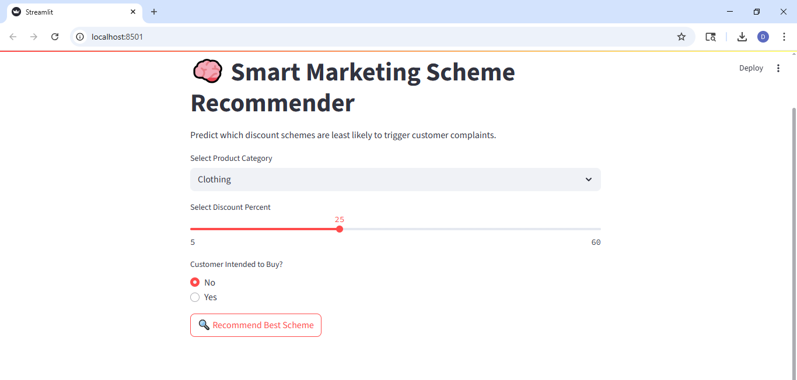
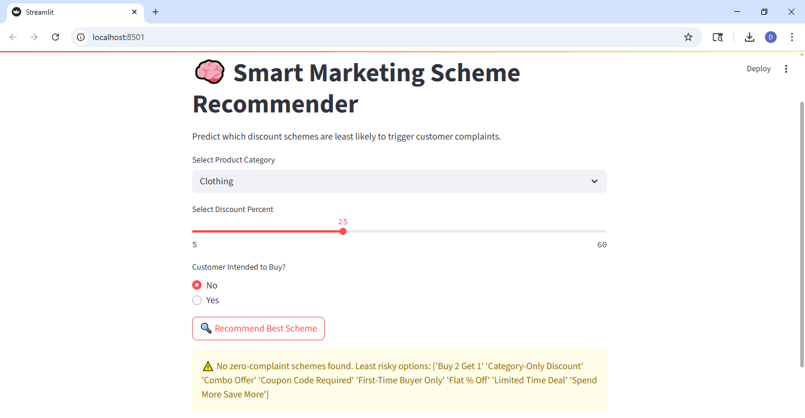
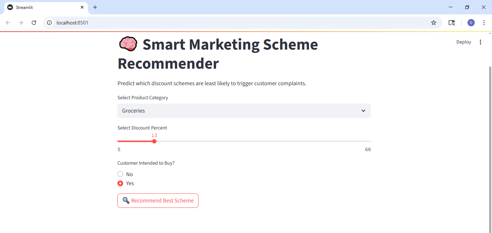
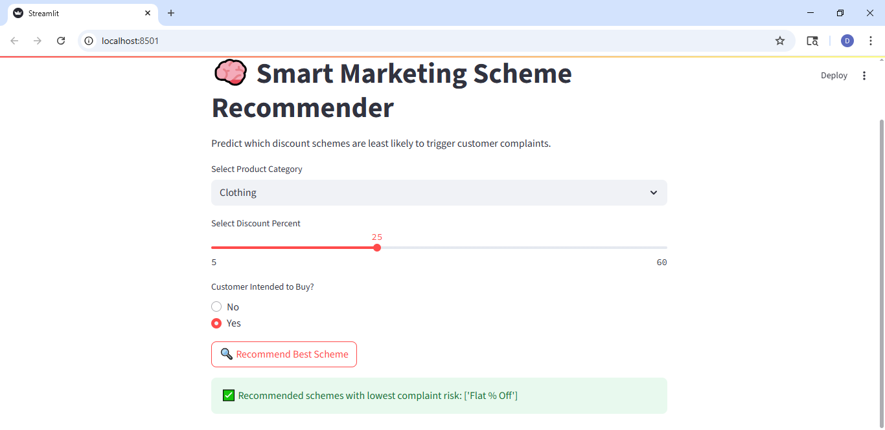

# 🧠 Smart_Discount_Analyzer
### Predict which marketing schemes cause customer complaints — and recommend safer, smarter alternatives.

---

## 🔍 Problem Statement

Modern marketing campaigns often use discount schemes to boost sales — but many offers end up backfiring, leading to **customer complaints**, **negative sentiment**, and **wasted purchases**.

This project addresses a real frustration:  
> ❌ Customers feel tricked or misled by offers that don’t really apply.  
> ✅ Can we use AI to **detect risky discount schemes** — and **recommend better ones**?

---

## 💡 Solution

**Smart_Discount_Analyzer** is a full ML/NLP-powered pipeline that:

- Predicts whether a given marketing scheme will cause a complaint
- Explains **why** the prediction was made (SHAP)
- Recommends the **least risky offer** for any product, discount, and customer intent
- Provides a **Streamlit web app** to explore recommendations interactively

---

## 🧠 Key Features

- ✅ **Custom dataset generator** with realistic customer-product-discount-complaint data
- 🧼 Cleaned & encoded features (PurchaseIntent, Discount%, ProductCategory, Scheme)
- 🤖 RandomForest Classifier trained to detect complaint types
- 🔍 **SHAP explainability** for model interpretation
- 🧠 **LDA topic modeling** to uncover complaint themes
- 🖥️ **Streamlit UI** for hands-on scheme testing
- 📊 Designed with business logic + customer behavior in mind

---

## 🖼️ Screenshots

| Input Form | Output Prediction |
|------------|-------------------|
|  |  |
|  |  |

---
